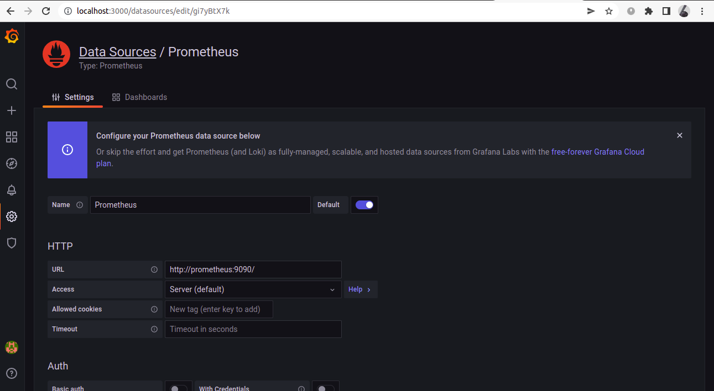
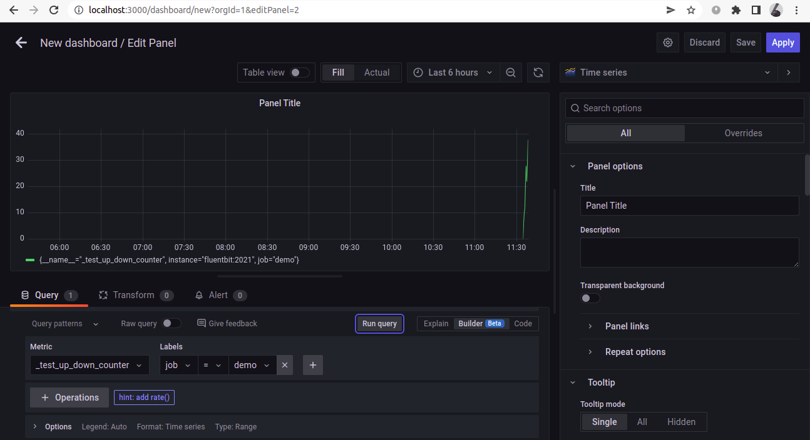
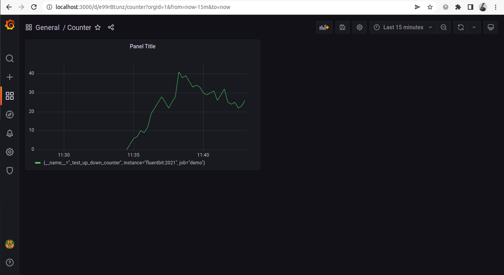
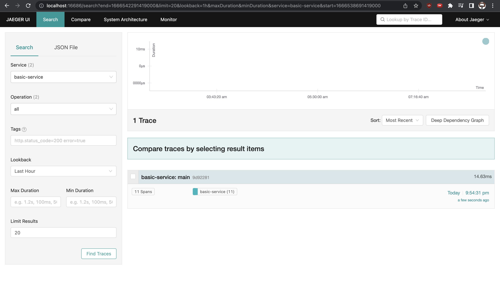
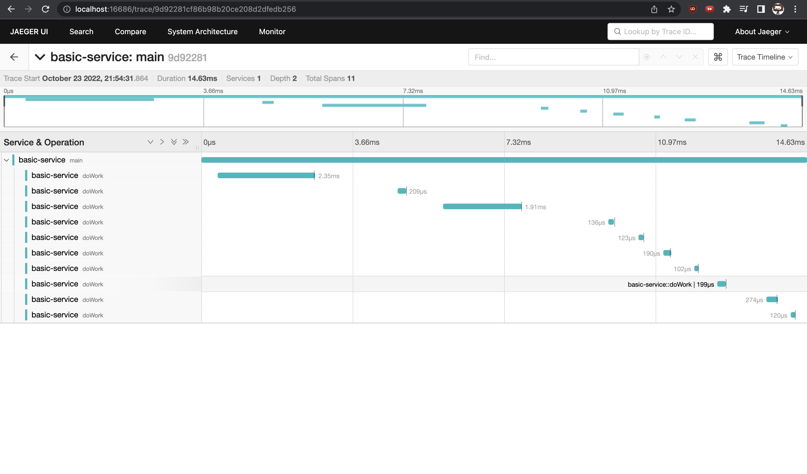

# Fluent Bit Observability Demo

Demo for using FluentBit to export otel traces and metrics.

Metrics:

We instrument an application using OpenTelemetry and send the metrics to FluentBit using the OpenTelemetry input plugin. We also use the [prometheus scraper](https://docs.fluentbit.io/manual/pipeline/inputs/prometheus-scrape-metrics) input plugin to scrape metrics exposed by jaeger. These are then exported using the [Prometheus exporter](https://docs.fluentbit.io/manual/pipeline/outputs/prometheus-exporter) output plugin. This can be now visualized in Grafana.

Traces:

We instrument an application using OpenTelemetry and send the trace data to FluentBit using the OpenTelemetry input plugin, which can then be sent to an otel compatible backend using the OpenTelemetry output plugin (Jaeger in this case to visualise trace data, we can also send it to the collector).

### Steps to set up:

1. Clone the repo and navigate to the directory
```
git clone https://github.com/Syn3rman/fluentbit-metrics-demo.git
cd fluentbit-metrics-demo
```

2. Run `docker-compose up -d --build` to start the application

3. Go to [`localhost:3000`](http://localhost:3000) and login to Grafana using credentials admin, admin

4. in configuration>data sources select Prometheus and add the url as `http://prometheus:9090/`



5. Create dashboard and add panel to visualize data



The dashboard now should look something like this




### Visualize trace data

1. Navigate to `localhost:16686/`(http://localhost:16686/), select the correct service and find traces.






### Directory structure

app/
	metrics.js: OpenTelemetry instrumented application that exports metrics to an endpoint (FluentBit here) using the otlp protocol
	tracing.js: OpenTelemetry instrumented application that exports trace data to an endpoint (FluentBit here) using the otlp protocol

fluentbit/
	fluent.conf: FluentBit configuration file. We are using the OpenTelemetry and prometheus scraper input plugin to accept data, and the opentelemetry and prometheus exporter output plugins to send data to jaeger and prometheus. The prometheus export output plugin starts a server which can be scraped by Prometheus.

prometheus/
	prometheus.yml: Prometheus config file, we use it to scrape metrics from FluentBit
